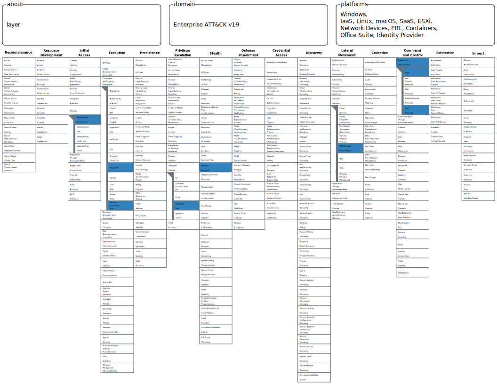

The SOC team detected unusual behavior from a user workstation shortly after opening an email attachment. Over time, multiple indicators appeared, including command execution, persistence, and communication with external infrastructure.
Link : 
	https://cyberhaze.io/challange-details/6a01edd7e82a439b197afd10

---
## Overview

This CyberHaze challenge presents a scenario simulating a real-world security incident that begins with a phishing email and ends with the attacker attempting to cover their tracks after executing several stages of the attack.

The challenge focuses on understanding how to link different events within a System of Operations (SOC) environment and transform them into a complete attack chain using the MITRE ATT&CK framework.

---
---
# Scenario Summary

The SOC team detected unusual activity on a user's device shortly after they opened an email attachment.

As the investigation continued, further indications emerged that the attacker had successfully executed several stages of the attack, including:

- Execution
    
- Persistence
    
- Command and Control
    
- Lateral Movement
    
- Defense Evasion
    

---
---
# MITRE ATT&CK Mapping

|Activity|MITRE Technique|
|---|---|
|Spearphishing Attachment|T1566.001|
|User Execution|T1204.002|
|PowerShell Execution|T1059.001|
|Command Shell Execution|T1059.003|
|Scheduled Task Persistence|T1053.005|
|SMB / Admin Shares|T1021.002|
|Application Layer Protocol|T1071|
|Indicator Removal|T1070.001|


---
---
# Attack Timeline

## 1. Initial Access

The attack began with an email containing a malicious attachment.

Once the user opened the file, the malicious content was executed on the device.

### MITRE Mapping

- T1566.001 – Spearphishing Attachment
    
- T1204.002 – User Execution
    

---
## 2. Execution via PowerShell

After the file was opened, PowerShell was used to execute encoded commands.

PowerShell is one of the most frequently used tools by attackers because it is included by default in Windows, making it difficult to distinguish between legitimate and malicious use.

### MITRE Mapping

- T1059.001 – PowerShell
    

---
## 3. Execution via Command Shell

In addition to PowerShell, the attacker used cmd.exe to execute further commands on the system.

This technique falls under the category of exploiting native system tools (Living Off The Land).

### MITRE Mapping

- T1059.003 – Command Shell
    

---
## 4. Persistence

After the initial successful execution, the attacker needed to ensure continued access to the system.

To achieve this, they created a scheduled task that would run automatically at predetermined intervals.

This method allowed the malware to reactivate even after the device was restarted.
### MITRE Mapping

- T1053.005 – Scheduled Task
    

---
## 5. Command and Control

The infected device began communicating with an external IP address using common application protocols such as HTTP or HTTPS.

Attackers use this technique to disguise their communications within normal network traffic.

### MITRE Mapping

- T1071 – Application Layer Protocol
    

---
## 6. Lateral Movement

After gaining control of the first device, the attacker moved on to other devices within the network.

This was done using the existing user account and Windows administrative tools such as SMB and Admin Shares, without needing to exploit any security vulnerabilities.

### MITRE Mapping

- T1021.002 – SMB / Windows Admin Shares
    

---
## 7. Defense Evasion

In the final stage, the attacker attempted to cover their tracks by deleting or modifying system logs.

This tactic is used to reduce the evidence available to investigators during the incident response process.

### MITRE Mapping

- T1070.001 – Clear Windows Event Logs / Indicator Removal
    

---
# Attack Flow

```text
Email Attachment
      │
      ▼
User Opens File
      │
      ▼
PowerShell Execution
      │
      ▼
CMD Execution
      │
      ▼
Scheduled Task Persistence
      │
      ▼
C2 Communication
      │
      ▼
Lateral Movement via SMB
      │
      ▼
Log Clearing & Defense Evasion
```

---
---
# SOC Analyst Perspective

From an SOC analyst's perspective, none of these events alone was sufficient to confirm a breach.

However, when the events were corroborated, a clear picture emerged of a multi-stage attack:

- Suspicious email

- PowerShell execution

- Scheduled task creation

- Frequent external connections

- Lateral movement within the network

- Log deletion

This type of correlation is what allows for the detection of genuine attacks, rather than relying on isolated indicators.

---

# Key Takeaways

- Email remains one of the most common methods of attack.
	
- PowerShell and Command Prompt (CMD) are among the most frequently exploited tools by attackers due to their default presence in Windows.
	
- Scheduled tasks are one of the most common persistence techniques.
	
- Lateral movement often relies more on available privileges than on exploiting vulnerabilities.
	
- Deleted logs are a strong indicator of an attempt to conceal malicious activity.
	
- A successful SOC analyst relies on connecting the dots and constructing a complete breach story.

---

# Conclusion

This challenge represents a model of a real, multi-stage attack that begins with Spearphishing and gradually progresses to Execution, Persistence, Command & Control, Lateral Movement, and finally Defense Evasion.

The most important lesson from this scenario is that detecting attacks does not depend on a single event, but rather on the ability to connect and analyze a series of suspicious activities within a framework such as MITRE ATT&CK to gain a complete picture of the incident.