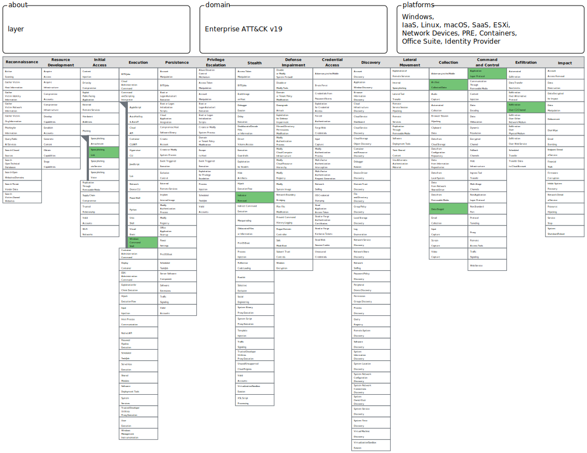

An internal system exhibited signs of compromise after user interaction with external content. The attacker executed commands, accessed credentials, established persistence, and eventually exfiltrated data outside the network.

Link : 
	https://cyberhaze.io/challange-details/6a01f4e8e82a439b197b0776

---
## Overview

This challenge analyzed a breach scenario that began with user interaction with malicious external content and ended with data theft and concealment of the attack. The goal of the challenge was to connect the various events within the MITRE ATT&CK framework and understand the complete attack sequence from the initial access stage to the stage of covering up the malicious activity.

---
# Scenario Summary

An internal system exhibited signs of compromise after user interaction with external content. The attacker executed commands, accessed credentials, established persistence, communicated with external infrastructure, collected sensitive files, and ultimately exfiltrated data outside the organization before attempting to remove traces of the intrusion.

---

# MITRE ATT&CK Mapping

|Phase|Technique|ID|
|---|---|---|
|Initial Access|Spearphishing Link|T1566.002|
|Execution|Windows Command Shell|T1059.003|
|Credential Access|LSASS Memory|T1003.001|
|Persistence|Registry Run Keys / Startup Folder|T1547.001|
|Command & Control|Application Layer Protocol: Web Protocols|T1071.001|
|Collection|Data Staged|T1074|
|Collection|Archive Collected Data|T1560|
|Exfiltration|Exfiltration Over C2 Channel|T1041|
|Defense Evasion|Indicator Removal on Host|T1070|


---
# Attack Chain Analysis

## 1. Initial Access – Spearphishing Link (T1566.002)

The attack started when the victim clicked on a malicious hyperlink delivered through email.

Unlike phishing campaigns that rely on malicious attachments, the attacker used a specially crafted link that required user interaction. This technique often bypasses attachment-based security controls and increases the likelihood of successful compromise.

### ATT&CK Details

- Tactic: Initial Access
    
- Technique: Phishing
    
- Sub-technique: Spearphishing Link
    

---

## 2. Execution – Windows Command Shell (T1059.003)

After gaining access, the attacker executed commands through the Windows Command Shell (cmd.exe).

Using built-in operating system utilities is a common Living-Off-The-Land (LOTL) technique that allows attackers to blend malicious activity with legitimate system behavior.

### ATT&CK Details

- Tactic: Execution
    
- Sub-technique: Windows Command Shell
    

---

## 3. Credential Access – LSASS Memory (T1003.001)

The attacker extracted credentials directly from the memory of the LSASS process.

LSASS stores authentication-related information including:

- User credentials
    
- NTLM hashes
    
- Kerberos tickets
    

Access to these artifacts can facilitate privilege escalation and lateral movement across the environment.

### ATT&CK Details

- Tactic: Credential Access
    
- Sub-technique: LSASS Memory
    

---

## 4. Persistence – Registry Run Keys (T1547.001)

To survive system reboots and maintain long-term access, the attacker modified Registry Run Keys.

Programs referenced in these registry locations are automatically executed whenever a user logs into the system, making them a popular persistence mechanism.

### ATT&CK Details

- Tactic: Persistence
    
- Sub-technique: Registry Run Keys / Startup Folder
    

---

## 5. Command & Control – Web Protocols (T1071.001)

Following persistence, the attacker established communication with an external command-and-control server using standard web protocols.

HTTP and HTTPS traffic are frequently chosen because they blend naturally into normal network activity.

### ATT&CK Details

- Tactic: Command and Control
    
- Sub-technique: Web Protocols
    

---

## 6. Collection – Data Staged (T1074)

Before exfiltration, the attacker gathered sensitive files from multiple locations and consolidated them into a staging directory.

This process simplifies data management and prepares the files for transfer.

### ATT&CK Details

- Tactic: Collection
    
- Technique: Data Staged
    

---

## 7. Archive Collected Data (T1560)

The attacker compressed the staged files into an archive.

Common reasons include:

- Reducing data size
    
- Simplifying transmission
    
- Avoiding content inspection mechanisms
    

### ATT&CK Details

- Tactic: Collection
    
- Technique: Archive Collected Data
    

---

## 8. Exfiltration – Over C2 Channel (T1041)

The archived data was transmitted to attacker-controlled infrastructure through the previously established command-and-control channel.

Reusing an existing communication path reduces the likelihood of detection because no additional suspicious connections need to be created.

### ATT&CK Details

- Tactic: Exfiltration
    
- Technique: Exfiltration Over C2 Channel
    

---

## 9. Defense Evasion – Indicator Removal on Host (T1070)

To hinder forensic investigations, the attacker attempted to remove traces of malicious activity.

Evidence suggested log tampering or deletion, making incident reconstruction more difficult.

### ATT&CK Details

- Tactic: Defense Evasion
    
- Technique: Indicator Removal on Host
    

---

# Attack Flow

```text
T1566.002
Spearphishing Link
        │
        ▼
T1059.003
Windows Command Shell
        │
        ▼
T1003.001
LSASS Memory
        │
        ▼
T1547.001
Registry Run Keys
        │
        ▼
T1071.001
Web Protocols (C2)
        │
        ▼
T1074
Data Staged
        │
        ▼
T1560
Archive Collected Data
        │
        ▼
T1041
Exfiltration Over C2 Channel
        │
        ▼
T1070
Indicator Removal on Host
```

---

# Key Takeaways

This scenario demonstrates a complete cyber intrusion lifecycle that aligns closely with real-world threat actor behavior.

Several important attacker tradecraft patterns were observed:

- Social engineering was used for initial compromise.
    
- Native Windows tools were leveraged for execution.
    
- Credentials were extracted from LSASS memory.
    
- Registry-based persistence ensured long-term access.
    
- Web protocols were used for command-and-control traffic.
    
- Data was staged and archived before exfiltration.
    
- Log tampering was performed to conceal evidence.
    

For SOC analysts, understanding how these ATT&CK techniques connect together is essential for building detections, performing investigations, and reconstructing attack timelines during incident response activities.

---

# Conclusion

The attacker successfully progressed through multiple stages of the cyber kill chain, beginning with a phishing link and ending with data exfiltration and evidence removal. Mapping each action to the MITRE ATT&CK framework provides a structured understanding of adversary behavior and highlights the detection opportunities available to defenders throughout the attack lifecycle.
